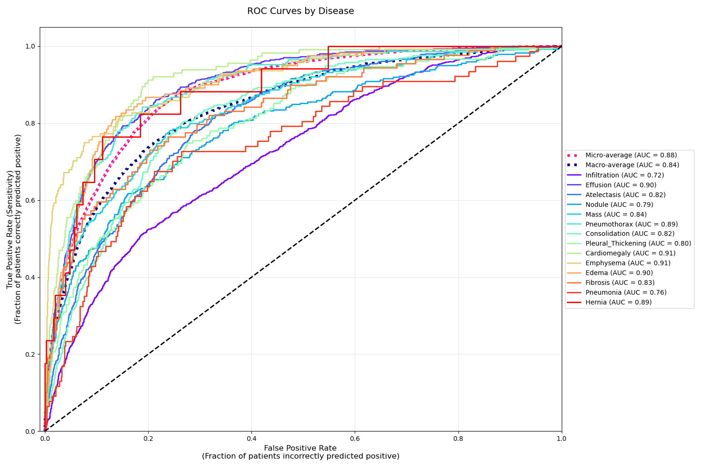

# ChestX-ray14 2025 Analysis

G. Fisher January 2025

The AUC value reflects the test's ability to distinguish between diseased and nondiseased individuals. The range is from less than 0.5, which is a coin flip, to 1.0, perfection.

| Disease            | Fisher 2025 | Rajpurkar 2017 | Bhusala & Panday 2024 | Hasanah 2024 | Ahmad 2023 |
| ------------------ | ----------- | -------------- | --------------------- | ------------ | ---------- |
| Cardiomegaly       | 0.911       | 0.924          | 0.896                 | 0.922        | 0.920      |
| Emphysema          | 0.909       | 0.937          | 0.820                 | 0.935        | 0.870      |
| Effusion           | 0.892       | 0.887          | 0.820                 | 0.810        | 0.840      |
| Edema              | 0.891       | 0.927          | 0.820                 | 0.850        | 0.860      |
| Pneumothorax       | 0.888       | 0.888          | 0.890                 | 0.850        | 0.870      |
| Hernia             | 0.895       | 0.916          | 0.840                 | 0.936        | 0.850      |
| Mass               | 0.822       | 0.848          | 0.867                 | 0.820        | 0.830      |
| Fibrosis           | 0.825       | 0.804          | 0.810                 | 0.780        | 0.810      |
| Consolidation      | 0.825       | 0.893          | 0.810                 | 0.790        | 0.830      |
| Atelectasis        | 0.809       | 0.809          | 0.810                 | 0.820        | 0.850      |
| Pleural Thickening | 0.774       | 0.806          | 0.810                 | 0.790        | 0.820      |
| Nodule             | 0.724       | 0.780          | 0.655                 | 0.760        | 0.700      |
| Pneumonia          | 0.740       | 0.768          | 0.770                 | 0.810        | 0.800      |
| Infiltration       | 0.717       | 0.734          | 0.730                 | 0.700        | 0.750      |
| Mean               | 0.830       | 0.852          | 0.811                 | 0.827        | 0.829      |



Convolutional Neural Networks are increasingly useful in medical imaging problems. This analysis (Fisher 2025) uses the NIH ChestX-ray14 dataset of 112,120 chest x-rays represensing 14 diseases in 30,805 unique patients to produce the human practitioner-level AUC scores shown above for this study (Fisher, 2025) and other well-known studies.

I used Tensorflow 2.17 on an AWS g5.xlarge on-demand instance, running Amazon Linux 2023, in Jupyter notebooks, with Cuda compilation tools release 12.2. I combined the DenseNet121 base model with additional techniques described in detail below. The dataset was very unbalanced (many more normal than diseased) and I successfully used a DynamicWeightedBCE_wgt_smooth loss function rather than the more-common standard weighted cross entropy loss function.

The chart above reflects the results of an analysis that was terminated after only four epochs by early stopping, indicating that over-fitting had begun, giving hope that better results can be achieved with more work, which is ongoing.

The steps I took were the following

1. Download the images from the NIH to an AWS S3 bucket.
2. Resize the images from (1024, 1024, 1) to (320, 320, 3) on local storage. Three channels were required by the DenseNet121 base model and the choice of 320, 320 merely followed the convention set by others, probably balancing quality and memory considerations. It seems likely that with the large machines available today more detail could be wrung from the original-sized images and I am considering trying it on an AWS g5.24xlarge spot instance which has 384Gb of RAM compared to the 16Gb on my current g5.xlarge.
3. Create train, val, test datasets (90%, 5%, 5%) with evenly-distributed diseases and no patient overlap.
4. Using a 'toy' model I tested 18 loss functions and settled on DynamicWeightedBCE_wgt_smooth which produced the best results.
5. Finally, I set about testing the entire dataset with all 14 diseases on a 'real' model, modifying it until I achieved the results above.

## Dynamic Weighted Binary Cross-Entropy Loss Function with Label Smoothing

This section explains a custom TensorFlow loss function implementation that combines dynamic class weighting with label smoothing for binary classification tasks.

## Overview

The `DynamicWeightedBCE_wgt_smooth` class implements a specialized version of binary cross-entropy (BCE) loss that addresses two common challenges in binary classification:

1. Class imbalance through dynamic weighting
2. Model overconfidence through label smoothing

## Implementation

```python
class DynamicWeightedBCE_wgt_smooth(tf.keras.losses.Loss):
    def __init__(self, smoothing_factor=0.1):
        super().__init__()
        self.smoothing_factor = smoothing_factor
        
    def call(self, y_true, y_pred):
        epsilon = tf.keras.backend.epsilon()
        y_pred = tf.clip_by_value(y_pred, epsilon, 1-epsilon)
        
        # Calculate class ratios with smoothing
        pos_ratio = tf.reduce_mean(y_true, axis=0)
        smoothed_ratio = pos_ratio * (1 - self.smoothing_factor) + 0.5 * self.smoothing_factor
        
        pos_weights = 1.0 / (smoothed_ratio + epsilon)
        neg_weights = 1.0 / (1.0 - smoothed_ratio + epsilon)
        
        return -tf.reduce_mean(
            y_true * pos_weights * tf.math.log(y_pred) +
            (1-y_true) * neg_weights * tf.math.log1p(-y_pred)
        )
```

## Key Features

### 1. Dynamic Class Weighting

Unlike standard weighted BCE which uses fixed weights, this implementation calculates weights dynamically based on the current batch composition:

- Computes the positive class ratio (`pos_ratio`) for each batch
- Derives weights inversely proportional to class frequencies
- Automatically adjusts to changing class distributions

### 2. Label Smoothing

The implementation incorporates label smoothing through the `smoothing_factor` parameter:

- Moves class ratios slightly towards 0.5 (balanced distribution)
- Helps prevent the model from becoming overconfident
- Reduces the impact of noisy labels
- Default smoothing factor of 0.1 provides mild regularization

## Comparison with Standard Weighted BCE

### Standard Weighted BCE:
```python
class WeightedBinaryCrossentropy(tf.keras.losses.Loss):
    def __init__(self, pos_weight):
        super().__init__()
        self.pos_weight = pos_weight
        
    def call(self, y_true, y_pred):
        return tf.reduce_mean(
            -(self.pos_weight * y_true * tf.math.log(y_pred) +
              (1 - y_true) * tf.math.log(1 - y_pred))
        )
```

Key differences:

1. **Weight Calculation**
   - Standard: Uses fixed pre-defined weights
   - Dynamic: Calculates weights based on batch statistics
   
2. **Numerical Stability**
   - Standard: Basic implementation may have numerical stability issues
   - Dynamic: Includes epsilon terms and value clipping for stability
   
3. **Label Smoothing**
   - Standard: No built-in smoothing mechanism
   - Dynamic: Incorporates smoothing to prevent overconfidence

## Usage Example

```python
# Create loss function instance
loss_fn = DynamicWeightedBCE_wgt_smooth(smoothing_factor=0.1)

# Create and compile model
model = tf.keras.Sequential([...])
model.compile(
    optimizer='adam',
    loss=loss_fn,
    metrics=['accuracy']
)
```

## Mathematical Details

The loss computation follows this formula:

1. Calculate smoothed positive ratio:
   ```
   smoothed_ratio = pos_ratio * (1 - α) + 0.5 * α
   ```
   where α is the smoothing factor

2. Calculate class weights:
   ```
   pos_weights = 1 / (smoothed_ratio + ε)
   neg_weights = 1 / (1 - smoothed_ratio + ε)
   ```
   where ε is a small constant for numerical stability

3. Compute weighted cross-entropy:
   ```
   loss = -mean(pos_weights * y_true * log(y_pred) + 
               neg_weights * (1-y_true) * log(1-y_pred))
   ```

## Best Practices

1. **Smoothing Factor Selection**
   - Start with the default value of 0.1
   - Increase for noisier datasets (up to 0.2)
   - Decrease for cleaner datasets (down to 0.05)

2. **Monitoring**
   - Track both loss and accuracy metrics
   - Watch for signs of underconfident predictions with high smoothing

3. **Batch Size Considerations**
   - <u>Use sufficiently large batch sizes (16 or larger)</u>
   - Ensures stable ratio estimates for weight calculation

## Limitations

1. Only suitable for binary classification tasks
2. Requires batch sizes large enough for reliable ratio estimation
3. May need tuning of smoothing factor for optimal performance
4. Additional computational overhead compared to standard BCE


## DenseNet121 Model with CBAM Attention Architecture

This section details a deep learning model that combines DenseNet121 with Convolutional Block Attention Module (CBAM) for improved feature attention and classification performance.

## Architecture Overview

The model architecture consists of three main components:
1. DenseNet121 as the backbone feature extractor
2. CBAM attention mechanism
3. Classification head with regularization

```python
def create_model(num_labels=NUM_CLASSES, input_shape=INPUT_SHAPE, dropout_rate=0.3):
    inputs = tf.keras.layers.Input(shape=input_shape)
    
    # Base DenseNet121
    base_model = tf.keras.applications.DenseNet121(
        weights='imagenet',
        include_top=False,
        input_tensor=inputs
    )
    
    # All layers are trainable by default
    x = base_model.output
    
    # Add Convolutional Block Attention Module (CBAM)
    
    # Channel Attention
    avg_pool = tf.keras.layers.GlobalAveragePooling2D()(x)
    max_pool = tf.keras.layers.GlobalMaxPooling2D()(x)
    
    avg_pool = tf.keras.layers.Reshape((1, 1, 1024))(avg_pool)
    max_pool = tf.keras.layers.Reshape((1, 1, 1024))(max_pool)
    
    shared_dense_1 = tf.keras.layers.Dense(512, activation='relu')
    shared_dense_2 = tf.keras.layers.Dense(1024)
    
    avg_pool = shared_dense_1(avg_pool)
    max_pool = shared_dense_1(max_pool)
    avg_pool = shared_dense_2(avg_pool)
    max_pool = shared_dense_2(max_pool)
    
    channel_attention = tf.keras.layers.Add()([avg_pool, max_pool])
    channel_attention = tf.keras.layers.Activation('sigmoid')(channel_attention)
    
    # Apply channel attention
    x = tf.keras.layers.Multiply()([x, channel_attention])
    
    # Spatial Attention
    avg_pool = tf.keras.layers.Lambda(lambda x: tf.keras.backend.mean(x, axis=-1, keepdims=True))(x)
    max_pool = tf.keras.layers.Lambda(lambda x: tf.keras.backend.max(x, axis=-1, keepdims=True))(x)
    spatial_attention = tf.keras.layers.Concatenate()([avg_pool, max_pool])
    
    spatial_attention = tf.keras.layers.Conv2D(1, kernel_size=7, padding='same', activation='sigmoid')(spatial_attention)
    
    # Apply spatial attention
    x = tf.keras.layers.Multiply()([x, spatial_attention])
    
    # Global pooling and classification layers
    x = tf.keras.layers.GlobalAveragePooling2D()(x)
    
    x = tf.keras.layers.Dense(128, activation='relu', kernel_regularizer=tf.keras.regularizers.L2(0.001))(x)
    x = tf.keras.layers.Dropout(dropout_rate)(x)
    
    x = tf.keras.layers.Dense(64, activation='relu', kernel_regularizer=tf.keras.regularizers.L2(0.001))(x)
    x = tf.keras.layers.Dropout(dropout_rate)(x)
    
    outputs = tf.keras.layers.Dense(num_labels, activation='sigmoid')(x)
    
    model = tf.keras.models.Model(inputs=inputs, outputs=outputs)
    return model
```

## Component Details

### 1. DenseNet121 Backbone

- Pre-trained on ImageNet
- Weights are retained and fine-tunable
- Top layers are removed for custom classification head

Key characteristics of DenseNet:
- Dense connectivity pattern
- Feature reuse through direct connections
- Reduced number of parameters
- Strong gradient flow

### 2. CBAM Attention Module

The CBAM consists of two sequential sub-modules:

#### Channel Attention
1. Parallel processing of input features through:
   - Global Average Pooling
   - Global Max Pooling
2. Shared Multi-Layer Perceptron network:
   - First dense layer: 1024 → 512 (ReLU)
   - Second dense layer: 512 → 1024
3. Feature fusion:
   - Addition of processed pooled features
   - Sigmoid activation for attention weights
4. Channel-wise multiplication with input features

#### Spatial Attention
1. Feature aggregation across channels:
   - Average pooling across channels
   - Max pooling across channels
2. Concatenation of pooled features
3. 7×7 convolution with sigmoid activation
4. Spatial-wise multiplication with input features

### 3. Classification Head

The classification layers include:

1. Global Average Pooling
   - Reduces spatial dimensions
   - Translation invariance
2. Dense Blocks
   - 128, 64 units with ReLU activation
   - L2 regularization (λ=0.001)
   - Dropout (rate=0.3)
4. Output Layer
   - num_labels (14 in this case) units
   - Sigmoid activation for multi-label classification

## Implementation Details

### Input Requirements
- Input shape: Configurable through INPUT_SHAPE parameter, (320, 320, 3) in this case
- Preprocessing: `tf.keras.applications.densenet.preprocess_input`
- RGB (3 channel) images expected

### Model Parameters
- num_labels: Number of classification categories (14, `len(label_text)`)
- label_text: in order by frequency ['Infiltration', 'Effusion', 'Atelectasis', 'Nodule', 'Mass', 'Pneumothorax', 'Consolidation', 'Pleural_Thickening', 'Cardiomegaly', 'Emphysema', 'Edema', 'Fibrosis', 'Pneumonia', 'Hernia']
- dropout_rate: Dropout probability (default: 0.3)

### Regularization Techniques
1. Dropout layers (rate=0.3)
2. L2 regularization on dense layers (λ=0.001)
3. Attention mechanisms act as implicit regularization

## Advantages of This Architecture

1. Feature Enhancement
   - CBAM helps focus on relevant features
   - Both channel and spatial attention
   - Adaptive feature refinement
2. Regularization Benefits
   - Multiple dropout layers & L2 regularization
   - Attention-based feature selection
3. Transfer Learning
   - Pre-trained DenseNet backbone
   - Feature reuse from ImageNet
4. Flexibility
   - Adjustable number of output classes
   - Configurable dropout rate
   - Modifiable dense layer dimensions
5. Much simpler than models employed by other studies

## Deep Learning Model Training Callbacks

This section describes the callbacks used during model training to monitor performance, prevent overfitting, and save training progress.

## Overview

The training process utilizes four key callbacks:
1. Early Stopping
2. Learning Rate Reduction
3. Model Checkpointing
4. Custom CSV Training Logger

## Early Stopping Callback

The Early Stopping callback prevents overfitting by monitoring validation loss stopping training when improvement stalls and restoring the weights from the best epoch.

Key Parameters:
- Monitor: Validation loss
- Patience: 10 epochs
- Minimum Delta: 0.00001
- Restore Best Weights: Yes
- Mode: Minimize

## Learning Rate Schedule Callback

The ReduceLROnPlateau callback dynamically adjusts the learning rate during training to fine-tune model performance.

Key Parameters:
- Monitor: Validation loss
- Reduction Factor: 0.5 (halves the learning rate)
- Patience: 3 epochs
- Minimum Delta: 0.0001
- Minimum Learning Rate: 1e-6

This adaptive learning rate strategy adjusts after 3 epochs of no improvement, which allows at least three such periods before early stopping kicks in.
## Model Checkpoint Callback

The ModelCheckpoint callback saves model states during training, ensuring no progress is lost and allowing for model recovery.

Key Features:
- Saves complete model (not just weights)
- Saves only when validation loss improves
- Filename includes epoch number and validation loss
- Checkpoint directory: "model_checkpoints/"

The naming convention "weights.{epoch:04d}-{val_loss:.5f}.keras" provides:
- Easy identification of training progress
- Quick comparison of model performance
- Chronological tracking of improvements

## Custom CSV Training Logger

A custom callback that logs comprehensive training metrics to a CSV file for detailed analysis and visualization, particularly the creation of loss-function graphs.

Key Features:
- Creates logging directory if needed and handles file creation and headers automatically
- Timestamps each training epoch
- Records multiple metrics including:
  - Loss values (training and validation)
  - AUC scores
  - Recall metrics
  - Specificity measures
  - F1 scores
  - Hamming loss
  - Positive/Negative Predictive Values

## Model Evaluation Metrics

This section describes the metrics used to evaluate model performance, including both custom implementations and standard TensorFlow metrics.

## Overview

The evaluation framework includes seven key metrics:
1. Recall (Standard TensorFlow)
2. Specificity (Custom)
3. AUC (Standard TensorFlow)
4. Positive Predictive Value/Precision (Standard TensorFlow)
5. Negative Predictive Value (Custom)
6. F1 Score (Standard TensorFlow)
7. Hamming Loss (Custom)

## Custom Metrics

### 1. Specificity (True Negative Rate)

A custom implementation that measures the model's ability to correctly identify negative cases.

Key Features:
- Tracks true negatives (TN) and total negatives (PN)
- Calculated as TN / PN
- Handles batch-wise updates
- Includes epsilon term for numerical stability

Use Cases:
- Critical in medical diagnosis where false positives must be minimized
- Important for imbalanced datasets
- Complementary to sensitivity/recall

### 2. Hamming Loss

A custom metric that quantifies the fraction of incorrect predictions (both false positives and false negatives).

Key Features:
- Configurable prediction threshold (default: 0.5)
- Batch-wise computation
- Normalized by sample count
- Suitable for multi-label classification

Use Cases:
- Multi-label classification evaluation
- When prediction errors have equal cost
- General model performance assessment

## Standard TensorFlow Metrics

### 1. Recall (Sensitivity)
- Measures proportion of actual positive cases correctly identified
- Built-in TensorFlow implementation
- Crucial for medical diagnosis and fraud detection

### 2. Area Under Curve (AUC)
- Configured for multi-label classification
- Measures model's ability to distinguish between classes
- Independent of classification threshold

### 3. Precision (Positive Predictive Value)
- Measures proportion of positive predictions that are correct
- Standard TensorFlow implementation
- Important for minimizing false positives

### 4. F1 Score
- Harmonic mean of precision and recall
- Micro-averaged across labels
- Balanced metric for overall performance

### Key Parameters

1. Threshold Settings:
   - Prediction threshold for binary decisions
   - Affects Hamming Loss and F1 Score calculations
   - Configurable based on application needs

2. Multi-label Configuration:
   - AUC configured for multi-label scenarios
   - Number of labels specified
   - Micro-averaging for F1 Score

# Model Performance Analysis

## Training History


The training history reveals several key insights about the model's learning progression:

### Loss Curves
- Training loss shows consistent decrease throughout training
- Validation loss initially decreases but starts increasing after epoch 4 (red dashed line)
- Early stopping triggered to prevent overfitting

### AUC Performance
- Training AUC steadily improves, reaching ~0.98
- Validation AUC peaks around epoch 4 at ~0.82
- Clear signs of overfitting as training and validation AUC diverge
- Model achieves the target AUC of 0.80 (green dashed line)

### Recall vs Specificity
- Training recall significantly improves over time (~0.85)
- Training specificity remains relatively stable (~0.45)
- Validation metrics show minimal improvement, suggesting potential learning issues
- Trade-off between recall and specificity is evident

### F1 Score
- Training F1 score shows steady improvement
- Validation F1 score remains relatively flat (~0.35)
- Target F1 score of 0.50 (green dashed line) not achieved in validation

### Hamming Loss
- Training Hamming loss decreases consistently
- Validation Hamming loss shows fluctuations
- Final validation Hamming loss ~0.08

### Precision and NPV
- High NPV (~0.9) for both training and validation
- Lower Precision/PPV (~0.3) indicates challenges with false positives
- Stable metrics throughout training

## ROC Curve Analysis


The ROC curves demonstrate the model's performance across different medical conditions:

### Overall Performance
- Micro-average AUC: 0.87
- Macro-average AUC: 0.83
- Most conditions show good discrimination ability (AUC > 0.80)

### Top Performing Conditions
1. Cardiomegaly (AUC = 0.91)
2. Effusion (AUC = 0.89)
3. Emphysema (AUC = 0.89)
4. Edema (AUC = 0.89)
5. Pneumothorax (AUC = 0.89)

### Challenging Conditions
1. Infiltration (AUC = 0.72)
2. Pneumonia (AUC = 0.75)
3. Nodule (AUC = 0.77)
4. Pleural Thickening (AUC = 0.77)

### Key Observations
- All conditions show better-than-random performance (above diagonal line)
- Significant variation in performance across conditions
- Some conditions show excellent separation (e.g., Cardiomegaly)
- Others show more moderate discrimination (e.g., Infiltration)

# <u>Overall Conclusions</u>

### Strengths
1. Good overall discrimination ability (micro-AUC = 0.87)
2. Excellent performance on several critical conditions
3. High NPV across conditions

### Areas for Improvement
1. Manage overfitting (evident in training curves)
2. Improve detection of challenging conditions
3. Better balance between precision and recall

# Author

George Fisher

https://georgefisher.com/resume/resume.pdf
